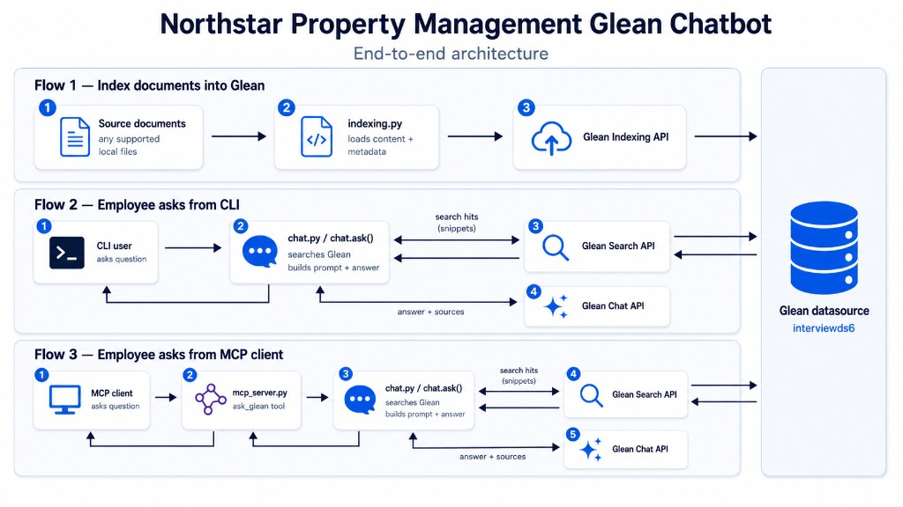

# Design Note — Northstar Property Management Glean Chatbot

## Overview

Internal employee chatbot for **Northstar Residential Management**. Ten local policy documents in `documents/` are indexed into the Glean sandbox datasource `interviewds6`. Employees ask questions via CLI or Claude Desktop (MCP) and receive grounded answers with source documents.

**Sandbox:** `support-lab` / `https://support-lab-be.glean.com`

## How Glean APIs are used

### 1. Indexing API — `indexing.py`

- **Token:** `GLEAN_INDEXING_API_TOKEN`
- **SDK call:** `client.indexing.documents.add_or_update(document=DocumentDefinition(...))`

**What it does:**

1. Reads `documents/glean_index_manifest.json` for document metadata (`id`, `title`, `filename`, `view_url`)
2. Loads markdown body from each file in `documents/`
3. Sanitizes document IDs to alphanumeric (`northstar-standard-lease-terms` → `northstarstandardleaseterms`) per Glean constraints
4. Uploads each document with `object_type: Article`, `allow_anonymous_access: true`

**Validated on `interviewds6`:**

- Object type must be `Article` (not `document`)
- All 10 documents indexed successfully (HTTP 200)

### 2. Search API — `search.py`

- **Token:** `GLEAN_SEARCH_API_TOKEN`
- **SDK call:** `client.client.search.query(...)`

**What it does:**

1. Takes the user's question
2. Queries Glean with `datasource_filter=interviewds6`, `page_size=5`, `max_snippet_size=400`
3. Parses `result.snippets[].text` for snippet text and `result.document.id` for document IDs
4. Returns a list of `{document_id, title, url, snippet}` dicts

### 3. Chat API — `chat.py`

- **Token:** `GLEAN_CLIENT_API_TOKEN`
- **Header:** `X-Glean-ActAs: alex@glean-sandbox.com` (required for global Client token)
- **SDK call:** `client.client.chat.create(...)`

**What it does:**

1. Calls `search()` to retrieve top-k snippets
2. Builds a prompt with retrieved context and the user's question
3. Restricts chat to the datasource via `ChatRestrictionFilters(datasource_instances=[datasource])`
4. Extracts answer text from `response.messages[].fragments[].text`
5. Extracts citations from Chat response; falls back to search hits if Chat returns no citations
6. Returns `{question, answer, sources, search_hits, chat_id}`

**Observed behavior:**

- Responses take 15–45 seconds
- Glean Chat may include internal status text (e.g. "Preparing to use Glean Document Reader") mixed into the answer
- HTTP timeouts set to 120s to avoid premature failures

## End-to-end flow

**Ingest → retrieve → generate → return:**

1. **Ingest:** `python indexing.py` uploads all policy docs once
2. **Retrieve:** Search API finds relevant snippets for the question
3. **Generate:** Chat API produces an answer constrained to those documents
4. **Return:** Answer plus source titles, URLs, and snippets

## MCP tool — `mcp_server.py`

Single tool `ask_glean` wraps `chat.ask()`.

- **Input:** `question` (string)
- **Output:** Plain-text answer with an explicit `Sources:` section (titles, URLs, snippets)
- **Transport:** stdio via FastMCP, configured in Claude Desktop's `claude_desktop_config.json`

**MCP vs CLI:** Both call the same `ask()` function. Claude may paraphrase tool output; the formatted `Sources:` block and tool description instruct Claude to include citations in its reply.

## Key tradeoffs and limitations

| Decision                            | Rationale                              | Limitation                                                                                                                       |
| ----------------------------------- | -------------------------------------- | -------------------------------------------------------------------------------------------------------------------------------- |
| `allowAnonymousAccess: true`        | Simplifies sandbox permissions         | Not suitable for production sensitive documents                                                                                  |
| Static local file ingest + manifest | Fast to demo; no connector setup       | Only local markdown files are indexed. Adding other sources would need more setup. If a policy doc changes, re-run `indexing.py` |
| Single datasource (`interviewds6`)  | Matches sandbox assignment constraints | Multi-datasource queries need code changes                                                                                       |
| Hardcoded `documents/` path         | Simpler setup for reviewers            | Cannot point indexing at a different folder without code change                                                                  |
| Default `top_k=5` from `.env`       | Balances context size vs latency       | Larger `top_k` slows Chat; smaller may miss relevant docs                                                                        |
| Sources fallback to search hits     | Chat citations are sometimes empty     | Sources may reflect search metadata rather than Chat citations                                                                   |
| 120s HTTP timeouts                  | Chat can be slow in sandbox            | User waits up to 2 minutes on failures                                                                                           |

## Failure modes

- **Missing or wrong API token** — Indexing, Search, or Chat fails with auth error; each script uses its own token.
- **Missing `GLEAN_ACT_AS`** — Chat API fails; Search and Indexing still work.
- **Documents not indexed** — Search returns no hits; answers are empty or ungrounded.
- **Index propagation delay** — Newly indexed docs may not appear in search for several minutes.
- **Glean Chat timeout** — MCP catches `ReadTimeout` and returns an error message.
- **MCP client shows weaker answers than CLI** — Claude summarizes tool output instead of quoting it verbatim.

## Validation and logging

### `validate.py`

Live smoke tests (no pytest dependency). Runs 5 questions with known answers from the policy docs:

| Question                        | Expected fact |
| ------------------------------- | ------------- |
| Initial late fee?               | `$95`         |
| Monthly pet rent?               | `$35`         |
| 6-month lease premium?          | `$150`        |
| Emergency maintenance response? | `immediate`   |
| Month-to-month premium?         | `$300`        |

Each case checks the answer contains expected terms and sources reference the right document titles. Run with `python validate.py` after indexing (~1–2 min total).

### Logging

`indexing.py`, `search.py`, and `chat.py` use Python `logging` at INFO level:

- Index: document title per successful upload
- Search: hit count per query
- Chat: HTTP requests logged by the Glean SDK

### Manual validation performed

- [x] Indexed all 10 Northstar documents into `interviewds6`
- [x] Search returns relevant snippets for policy questions
- [x] Chat returns grounded answers with source documents
- [x] MCP tool connects in Claude Desktop and calls `ask_glean`
- [x] `validate.py` passes against live sandbox APIs